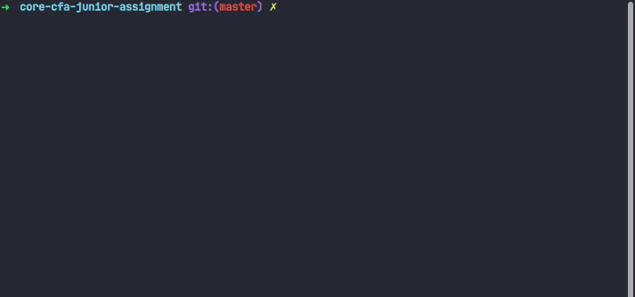
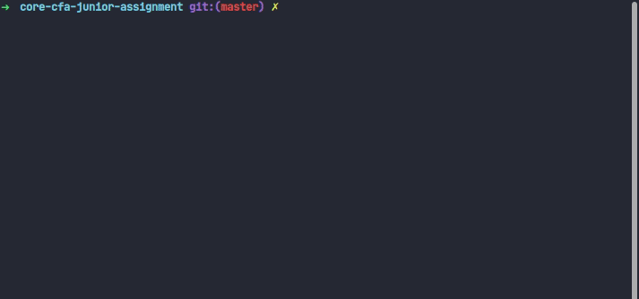

# 1. 🖥️ `watchTowr` javascript assignment

Welcome to the `watchTowr` javascript assignment.

> 💡 Please fork this repository before you get started!

We'll be working predominently with `React`, `Typescript` and `Node`. 

There are two sections to this assignment, the first being the expected must have requirements to be completed and the secondary good to have stretch goals that you're free to attempt if you have additional time. It's not expected you complete all the stretch goals of this assignment, but you're expected to complete at the primary requirements. 

# 2. 📖 Table of Contents

- [1. 🖥️ `watchTowr` javascript assignment](#1-️-watchtowr-javascript-assignment)
- [2. 📖 Table of Contents](#2--table-of-contents)
- [3. 🚀 How to get started](#3--how-to-get-started)
- [4. 🥅 Primary Goals](#4--primary-goals)
  - [4.1. Front-end React Task (1)](#41-front-end-react-task-1)
  - [4.2. Front-end React Task (2)](#42-front-end-react-task-2)
- [5. 🎯 Secondary Goals](#5--secondary-goals)
- [6. 👀 What we're specifically looking for](#6--what-were-specifically-looking-for)

# 3. 🚀 How to get started 

This project is bootstraped with `create-react-app` and the `typescript-template`. The css engine we're using is `chakra-ui`.

You're free to use the components provided by `chakra-ui` but we hope you at least take some time to customize the look to match to provided example.

As for other packages, feel free to import any other packages you see fit! That's what the JS community is for. However, do know that any package you install will be used against you 😉 during the interview!

# 4. 🥅 Primary Goals

## 4.1. Front-end React Task (1)

For the first primary goal is to create a Carousel that slides from left to right and right to left as with the following example:

These are the following acceptance criterias:

1. Given that there are more than 3 items in the carousel, 
   1. there should be navigation arrow on each side of the component to allow users to slide to the next set of 3 items.
   2. there should be a preview dot tab at the bottom of the carousel that informs based on the number of sets of 3 there are. For example, if there are 6 items, then there should be 2 dots that represent the number of sets. If there are 7 items, there should be 3 dots.
2. Given that there is less than 3 times in the set within the carousel,
   1. The card items should flush to the left of the component
3. Given that when the user clicks the navigation arrows or the preview dots, the carousel should slide smoothly in their respective directions

Feel free to use these acceptance criterias as your test suite cases!

**Pre start instructions:**

1. Please checkout a branch from `dev` with the name `feat/task-1`.
2. `feat/task-1` should be the working environment of your implementation. 
3. Use the `package.json` script `yarn start:task1` to initialize the project.
4. Happy hacking!

**Expected delivery instructions:**

1. We expect the code to be committed into a branch called `feat/task-1`
2. There should be a pull request called `feat: TASK-1 carousel component` to merge `feat/task-1` into `dev`.
3. Feel free to merge the branch from `feat/task-1` into main after you've completed the requirements.

## 4.2. Front-end React Task (2)

Please only attempt this part of the task **after** you've completed [Task 1](#31-front-end-react-task-1).

This next primary requirement is a extension to the [first task](#31-front-end-react-task-1)

We want to extend the usage of the carousel to accept data from a backend service.

Your acceptance criteria is as follows: 

1. Given component should fetch the relevant information from the provided mocked backend,
   1. then preload the relevant data before the last set of cards in the carousel to reduce load times for the user
   2. if the network request is too slow and the user has already reached the end of the carousel, then render a loading state to inform the user of the inflight request
2. Given the asynchronous data,
   1. the preview dots should reflect the total set of cards in the carousel after the values have been updated

**Pre start instructions:**

1. Please checkout a branch from `dev` with the name `feat/task-2`.
2. `feat/task-2` should be the working environment of your implementation. 
3. Use the `package.json` script `yarn start:task2` to initialize the project.
4. Happy hacking!

**Expected delivery instructions:**

1. Similarly to task 1, there should be a branch called `feat/task-2`
2. There should be a pull request called `feat: TASK-2 server data for carousel component` to merge `feat/task-2` into `dev`.
3. Feel free to merge the branch from `feat/task-2` into main after you've completed the requirements.

# 5. 🎯 Secondary Goals

Here are some secondary stretch goals you can try and accomplish if you find yourself itching for more!

1. Try switching out the mocked json service to a live http endpoint and deploy your carousel app!
2. Try to create an actual http service with express to service data so that you can deploy both your front-end and back-end code!
3. Try dockerizing both your back-end and front-end codebases and serve them locally with `docker-compose`!
4. Try adding client-side navigation to your carousel so you're able to navigate to a detail page from the cards!
5. Try adding to the drag event so it's compatible with mobile phones!

# 6. 👀 What we're specifically looking for

1. Thought process of code, the best way to showcase this is via commits
2. Structure of components and props passing, what are some ways you can structure your components so it doesn't break the single responsibility principle.
3. Managing of state and effects of data, how do you make sure your component doesn't render to often?
4. Eye for detail while implementing user interfaces, our designers painstakingly craft each user interface and we want to make sure we live up to their standards.
5. Having fun writing and building user interfaces! Our client facing product team members love product building.
